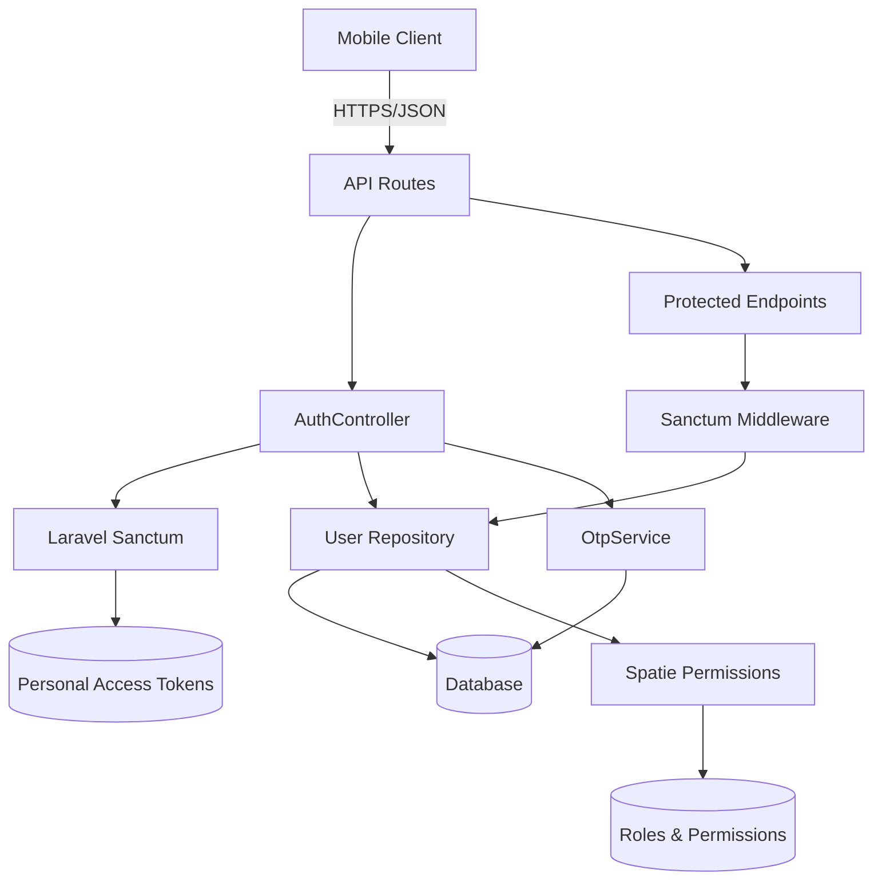
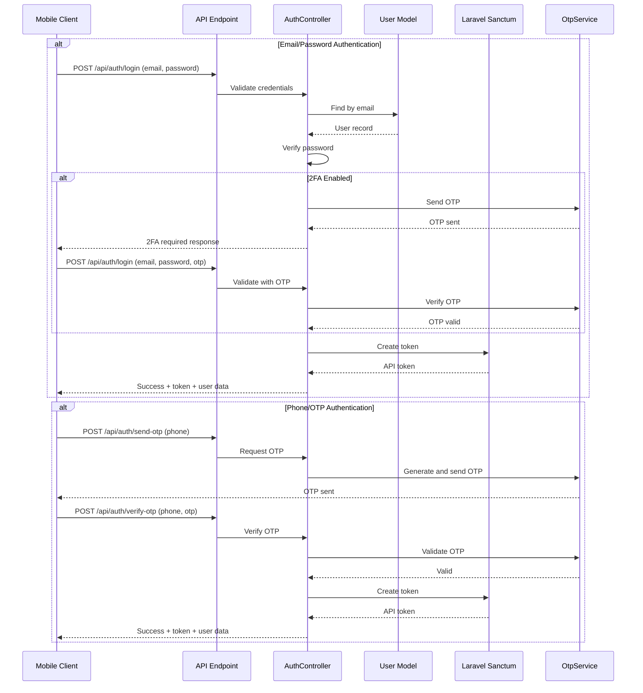
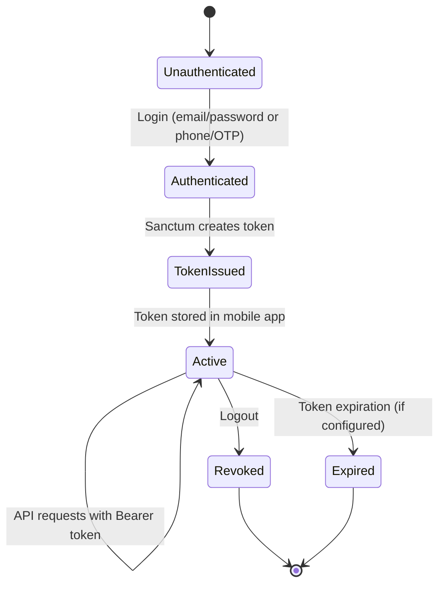

# Design Document: Mobile API Authentication

## Overview

This design specifies the technical implementation of REST API endpoints for mobile application authentication in the Laravel College Management System. The system will provide token-based authentication using Laravel Sanctum, enabling Android and Flutter mobile clients to authenticate users and access protected resources.

The design leverages existing infrastructure including:
- Laravel Sanctum for API token management
- Spatie Laravel Permission for role-based access control
- Existing User model with relationships (Student, Teacher, Parent, Alumni)
- Existing OtpService for two-factor authentication
- Existing password hashing and verification mechanisms

### Key Design Decisions

1. **Token-Based Authentication**: Use Laravel Sanctum instead of session-based authentication to support stateless mobile clients
2. **Email/Password Primary Flow**: Support email and password as the primary authentication method (aligning with web authentication)
3. **Phone/OTP Alternative Flow**: Maintain existing phone-based OTP authentication as an alternative method
4. **2FA Integration**: Support two-factor authentication for users with `two_factor_enabled` flag
5. **Role-Based Panel Type**: Map user roles to panel types for mobile dashboard routing
6. **JSON-Only Responses**: All endpoints return JSON without HTML/Blade views
7. **Versioned API Structure**: Use `/api/v1/` prefix for future extensibility

## Architecture

### High-Level Architecture



### Authentication Flow



### Token Lifecycle



## Components and Interfaces

### 1. API Routes (`routes/api.php`)

**Purpose**: Define API endpoints with appropriate middleware and rate limiting

**Endpoints**:

```php
// Authentication routes (throttled)
POST   /api/auth/login          - Email/password or phone/OTP login
POST   /api/auth/send-otp       - Send OTP to phone
POST   /api/auth/verify-otp     - Verify OTP and issue token
POST   /api/auth/logout         - Revoke current token (authenticated)

// User profile (authenticated)
GET    /api/v1/user             - Get authenticated user profile
```

**Middleware Configuration**:
- `throttle:3,1` for authentication endpoints (3 attempts per minute)
- `auth:sanctum` for protected endpoints
- JSON response middleware (force Accept: application/json)

### 2. AuthController (`app/Http/Controllers/Api/AuthController.php`)

**Purpose**: Handle authentication logic, token issuance, and user validation

**Methods**:

```php
class AuthController extends Controller
{
    public function __construct(OtpService $otpService)
    
    // Email/password authentication with optional 2FA
    public function login(LoginRequest $request): JsonResponse
    
    // Send OTP to phone number
    public function sendOtp(SendOtpRequest $request): JsonResponse
    
    // Verify OTP and issue token
    public function verifyOtp(VerifyOtpRequest $request): JsonResponse
    
    // Revoke current token
    public function logout(Request $request): JsonResponse
    
    // Helper: Determine panel type from user role
    private function getPanelType(User $user): string
    
    // Helper: Format user response data
    private function formatUserResponse(User $user): array
}
```

**Responsibilities**:
- Validate user credentials (email/password or phone/OTP)
- Check user active status
- Handle two-factor authentication flow
- Issue Sanctum API tokens
- Revoke tokens on logout
- Format consistent JSON responses
- Map user roles to panel types

### 3. Request Validation Classes

#### LoginRequest (`app/Http/Requests/LoginRequest.php`)

**Current Implementation**: Validates phone, password, and OTP

**Required Enhancement**: Add email validation support

```php
public function rules(): array
{
    return [
        'email' => ['required_without:phone', 'email', 'exists:users,email'],
        'phone' => ['required_without:email', 'string', 'regex:/^[0-9]{10,15}$/'],
        'password' => ['nullable', 'string', 'min:6'],
        'otp' => ['nullable', 'string', 'digits:6'],
    ];
}

public function withValidator($validator)
{
    $validator->after(function ($validator) {
        // Require either (email+password) or (phone+otp) or (phone+password)
        $hasEmail = $this->filled('email');
        $hasPhone = $this->filled('phone');
        $hasPassword = $this->filled('password');
        $hasOtp = $this->filled('otp');
        
        if (!$hasPassword && !$hasOtp) {
            $validator->errors()->add('auth', 'Either password or OTP is required');
        }
    });
}
```

#### SendOtpRequest (`app/Http/Requests/SendOtpRequest.php`)

**Current Implementation**: Validates phone number

**Status**: No changes required

#### VerifyOtpRequest (`app/Http/Requests/VerifyOtpRequest.php`)

**Current Implementation**: Validates phone and OTP

**Status**: No changes required

### 4. User Model Enhancement

**Current Status**: User model already has:
- `HasApiTokens` trait (Sanctum support)
- `HasRoles` trait (Spatie permissions)
- Relationships: student, teacher, parentProfile, alumnus
- Helper methods: isPrincipal(), isHod(), isTeacher(), isStudent(), isParent(), isAlumni()
- `primaryRole()` method

**Required Enhancement**: Add method to determine panel type

```php
public function getPanelType(): string
{
    return match (true) {
        $this->hasRole('principal') => 'admin',
        $this->hasRole('hod') => 'hod',
        $this->hasRole('teacher') => 'teacher',
        $this->hasRole('student') => 'student',
        $this->hasRole('parent') => 'parent',
        $this->hasRole('alumni') => 'alumni',
        default => 'guest',
    };
}
```

### 5. OtpService Integration

**Current Implementation**: `app/Services/OtpService.php`

**Existing Methods**:
- `sendOtp(string $identifier, string $method, User $user): array`
- `verifyOtp(string $phone, string $otpCode): array`
- `isRateLimited(string $phone): bool`

**Integration Points**:
- Used when `two_factor_enabled` is true
- Supports both email and phone methods
- Returns structured arrays with success/failure status

**Status**: No changes required - existing service is sufficient

### 6. Middleware Configuration

**Required Middleware**:

1. **ForceJsonResponse** (new middleware)
   - Force `Accept: application/json` header
   - Ensure all responses are JSON (no HTML redirects)
   - Apply to all `/api/*` routes

2. **Sanctum Authentication**
   - Already configured via `auth:sanctum`
   - Validates Bearer tokens
   - Loads authenticated user

3. **Throttle Middleware**
   - Authentication endpoints: `throttle:3,1` (3 per minute)
   - Protected endpoints: `throttle:60,1` (60 per minute)

## Data Models

### User Model Schema

```
users table:
├── id (primary key)
├── name (string)
├── email (string, unique)
├── phone (string, nullable)
├── password (hashed string)
├── avatar (string, nullable)
├── gender (enum: male, female, other)
├── dob (date, nullable)
├── address (text, nullable)
├── is_active (boolean, default: true)
├── two_factor_enabled (boolean, default: true)
├── two_factor_method (string: 'email' or 'phone')
├── preferences (json, nullable)
├── notification_preferences (json, nullable)
├── email_verified_at (timestamp, nullable)
├── remember_token (string, nullable)
├── created_at (timestamp)
├── updated_at (timestamp)
└── deleted_at (timestamp, nullable - soft deletes)

Relationships:
├── hasOne: student
├── hasOne: teacher
├── hasOne: parentProfile
├── hasOne: alumnus
├── hasOne: hodDepartment
├── hasMany: auditLogs
├── hasMany: createdNotices
├── hasMany: sentMessages
└── hasMany: receivedMessages

Roles (via Spatie):
├── principal
├── hod
├── teacher
├── student
├── parent
└── alumni
```

### Personal Access Tokens Schema (Sanctum)

```
personal_access_tokens table:
├── id (primary key)
├── tokenable_type (string - polymorphic)
├── tokenable_id (bigint - polymorphic)
├── name (string - token name: 'mobile-app')
├── token (string, unique, hashed)
├── abilities (text - JSON array of permissions)
├── last_used_at (timestamp, nullable)
├── expires_at (timestamp, nullable)
├── created_at (timestamp)
└── updated_at (timestamp)
```

### OTP Model Schema

```
otps table:
├── id (primary key)
├── phone (string - also used for email identifier)
├── otp (hashed string)
├── attempts (integer, default: 0)
├── expires_at (timestamp)
├── created_at (timestamp)
└── updated_at (timestamp)
```

## API Response Formats

### Success Response Structure

```json
{
  "success": true,
  "message": "Operation successful",
  "data": {
    // Response payload
  }
}
```

### Error Response Structure

```json
{
  "success": false,
  "message": "Error description",
  "errors": {
    "field": ["Validation error message"]
  }
}
```

### Login Success Response

```json
{
  "success": true,
  "message": "Login successful",
  "data": {
    "user": {
      "id": 1,
      "name": "John Doe",
      "email": "john@example.com",
      "phone": "9876543210",
      "avatar_url": "https://...",
      "role": "student",
      "panel_type": "student"
    },
    "token": "1|abc123...",
    "token_type": "Bearer"
  }
}
```

### 2FA Required Response

```json
{
  "success": false,
  "message": "Two-factor authentication required",
  "requires_2fa": true,
  "two_factor_method": "email",
  "data": {
    "otp_sent": true,
    "expires_in": 60
  }
}
```

### Validation Error Response (422)

```json
{
  "success": false,
  "message": "Validation failed",
  "errors": {
    "email": ["The email field is required."],
    "password": ["The password must be at least 6 characters."]
  }
}
```

### Authentication Error Response (401)

```json
{
  "success": false,
  "message": "Invalid credentials"
}
```

### Inactive Account Response (403)

```json
{
  "success": false,
  "message": "Your account is inactive. Please contact support."
}
```

### Rate Limit Response (429)

```json
{
  "success": false,
  "message": "Too many attempts. Please try again later."
}
```

## Error Handling

### Error Categories

1. **Validation Errors (422)**
   - Missing required fields
   - Invalid email format
   - Invalid phone format
   - Password too short
   - OTP format invalid

2. **Authentication Errors (401)**
   - Invalid credentials
   - Invalid or expired token
   - OTP verification failed
   - User not found

3. **Authorization Errors (403)**
   - Account inactive
   - Account suspended
   - Insufficient permissions

4. **Rate Limiting Errors (429)**
   - Too many login attempts
   - Too many OTP requests
   - API rate limit exceeded

5. **Server Errors (500)**
   - Database connection failure
   - External service failure (SMS/Email)
   - Unexpected exceptions

### Error Handling Strategy

1. **Validation Errors**
   - Use Laravel Form Requests
   - Return structured validation errors
   - Provide field-specific error messages

2. **Authentication Failures**
   - Log failed attempts for security monitoring
   - Return generic "Invalid credentials" message (prevent user enumeration)
   - Implement rate limiting to prevent brute force

3. **2FA Errors**
   - Track OTP attempts (max 5)
   - Expire OTPs after 1 minute
   - Rate limit OTP requests (1 per minute)

4. **Token Errors**
   - Return 401 for invalid/expired tokens
   - Clear token from client on 401 response
   - Require re-authentication

5. **Server Errors**
   - Log detailed error information
   - Return generic error message to client
   - Include error tracking ID for support

### Exception Handling Implementation

```php
// In app/Exceptions/Handler.php
public function render($request, Throwable $exception)
{
    // Force JSON for API routes
    if ($request->is('api/*')) {
        if ($exception instanceof ValidationException) {
            return response()->json([
                'success' => false,
                'message' => 'Validation failed',
                'errors' => $exception->errors(),
            ], 422);
        }
        
        if ($exception instanceof AuthenticationException) {
            return response()->json([
                'success' => false,
                'message' => 'Unauthenticated',
            ], 401);
        }
        
        if ($exception instanceof AuthorizationException) {
            return response()->json([
                'success' => false,
                'message' => 'Unauthorized',
            ], 403);
        }
        
        // Generic server error
        Log::error('API Error', [
            'exception' => get_class($exception),
            'message' => $exception->getMessage(),
            'trace' => $exception->getTraceAsString(),
        ]);
        
        return response()->json([
            'success' => false,
            'message' => 'An error occurred. Please try again later.',
        ], 500);
    }
    
    return parent::render($request, $exception);
}
```

## Testing Strategy

### Unit Tests

Unit tests will verify individual components in isolation:

1. **AuthController Unit Tests**
   - Test login with valid email/password
   - Test login with invalid credentials
   - Test login with inactive account
   - Test 2FA flow initiation
   - Test OTP sending
   - Test OTP verification
   - Test token issuance
   - Test logout and token revocation
   - Test panel type determination

2. **Request Validation Tests**
   - Test LoginRequest validation rules
   - Test email format validation
   - Test phone format validation
   - Test password requirements
   - Test OTP format validation
   - Test conditional validation logic

3. **User Model Tests**
   - Test getPanelType() for each role
   - Test role helper methods
   - Test relationships loading
   - Test avatar URL generation

4. **OtpService Tests** (existing)
   - Test OTP generation
   - Test OTP verification
   - Test rate limiting
   - Test expiration handling
   - Test attempt tracking

### Integration Tests

Integration tests will verify end-to-end API flows:

1. **Email/Password Authentication Flow**
   - Complete login flow with valid credentials
   - Login flow with 2FA enabled
   - Login flow with inactive account
   - Token usage for protected endpoints

2. **Phone/OTP Authentication Flow**
   - Send OTP request
   - Verify OTP and receive token
   - Use token for authenticated requests

3. **Token Management**
   - Token creation on login
   - Token validation on protected routes
   - Token revocation on logout
   - Multiple token handling

4. **Error Scenarios**
   - Invalid credentials handling
   - Rate limiting enforcement
   - Validation error responses
   - Server error handling

### API Tests

API tests will verify HTTP endpoints directly:

1. **POST /api/auth/login**
   - Test with email and password
   - Test with phone and password
   - Test with phone and OTP
   - Test with missing credentials
   - Test with invalid credentials
   - Test with 2FA enabled
   - Test rate limiting

2. **POST /api/auth/send-otp**
   - Test with valid phone
   - Test with invalid phone
   - Test with non-existent user
   - Test rate limiting

3. **POST /api/auth/verify-otp**
   - Test with valid OTP
   - Test with invalid OTP
   - Test with expired OTP
   - Test attempt limiting

4. **POST /api/auth/logout**
   - Test authenticated logout
   - Test unauthenticated logout
   - Test token revocation

5. **GET /api/v1/user**
   - Test with valid token
   - Test with invalid token
   - Test with expired token
   - Test relationship loading

### Test Configuration

```php
// Minimum 100 iterations for property-based tests (if applicable)
// Standard unit/integration tests use PHPUnit defaults

// Test database configuration
'testing' => [
    'driver' => 'sqlite',
    'database' => ':memory:',
],

// Sanctum configuration for testing
Sanctum::actingAs($user, ['*']);
```

### Manual Testing Checklist

- [ ] Test login with email/password from mobile client
- [ ] Test login with phone/OTP from mobile client
- [ ] Test 2FA flow with email OTP
- [ ] Test 2FA flow with phone OTP
- [ ] Test token usage in Authorization header
- [ ] Test logout and token revocation
- [ ] Test rate limiting on login endpoint
- [ ] Test rate limiting on OTP endpoint
- [ ] Test error responses in mobile app
- [ ] Test token expiration handling
- [ ] Test multiple device login (multiple tokens)
- [ ] Test network error handling
- [ ] Test offline behavior

## Implementation Notes

### Security Considerations

1. **Password Security**
   - Use Laravel's built-in password hashing (bcrypt)
   - Never return passwords in API responses
   - Enforce minimum password length (6 characters)

2. **Token Security**
   - Store tokens securely in mobile app (encrypted storage)
   - Use HTTPS for all API communication
   - Implement token expiration (optional, configurable)
   - Support token revocation on logout

3. **Rate Limiting**
   - Authentication endpoints: 3 attempts per minute
   - OTP endpoints: 1 request per minute
   - Protected endpoints: 60 requests per minute
   - Consider IP-based rate limiting for additional security

4. **2FA Security**
   - OTP expires after 1 minute
   - Maximum 5 verification attempts
   - Rate limit OTP requests
   - Use secure random number generation

5. **Error Messages**
   - Avoid user enumeration (generic "Invalid credentials")
   - Don't reveal whether email/phone exists
   - Log detailed errors server-side only

### Performance Considerations

1. **Database Queries**
   - Eager load user relationships when needed
   - Index email and phone columns
   - Use database transactions for token creation

2. **Token Storage**
   - Sanctum stores tokens in database
   - Consider token cleanup for expired tokens
   - Monitor personal_access_tokens table size

3. **Caching**
   - Cache user roles and permissions
   - Cache rate limiting counters in Redis
   - Consider caching user profile data

### Deployment Considerations

1. **Environment Configuration**
   - Configure Sanctum stateful domains
   - Set appropriate token expiration
   - Configure rate limiting thresholds
   - Set up SMS provider for OTP (production)

2. **Database Migrations**
   - Sanctum migrations already exist
   - No new migrations required
   - Verify indexes on users table

3. **Monitoring**
   - Log authentication attempts
   - Monitor failed login rates
   - Track API usage metrics
   - Alert on unusual patterns

4. **Documentation**
   - Provide API documentation for mobile developers
   - Document authentication flow
   - Provide example requests/responses
   - Document error codes and handling

### Future Enhancements

1. **Token Expiration**
   - Implement configurable token expiration
   - Add refresh token mechanism
   - Support token renewal

2. **Social Authentication**
   - Add Google OAuth support
   - Add Facebook OAuth support
   - Integrate with existing user accounts

3. **Biometric Authentication**
   - Support fingerprint authentication
   - Support face recognition
   - Store biometric preferences

4. **Enhanced Security**
   - Implement device fingerprinting
   - Add suspicious activity detection
   - Support account recovery flows

5. **Analytics**
   - Track login success/failure rates
   - Monitor authentication method usage
   - Analyze user engagement patterns
