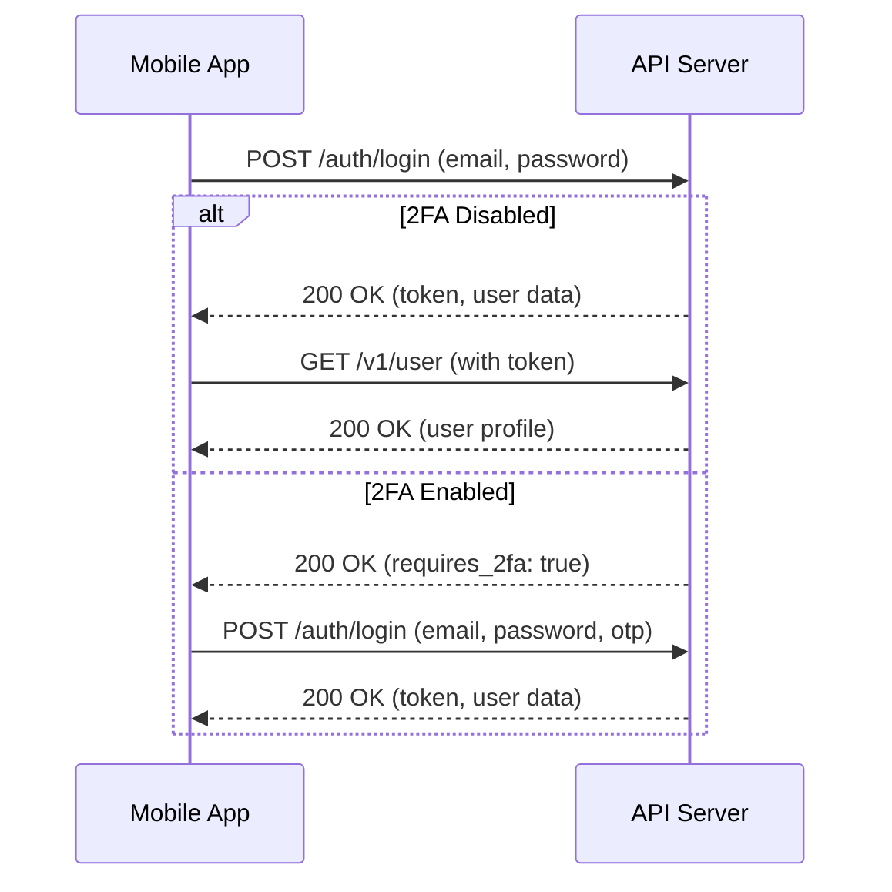
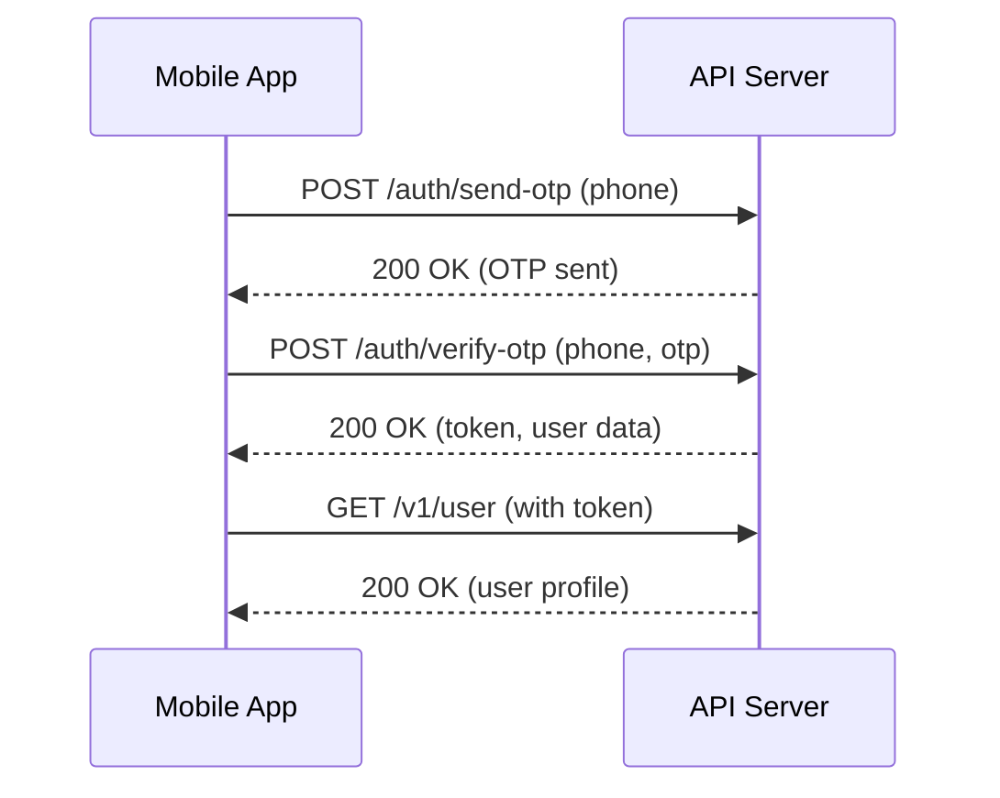

# Mobile API Documentation

## Overview

This document provides comprehensive documentation for the MMP CMS Mobile API. The API enables Android and Flutter mobile applications to authenticate users and access college management system data.

## Base URL

```
Development: http://localhost:8000/api
Production: https://your-domain.com/api
```

## Authentication

The API uses Laravel Sanctum for token-based authentication. All authenticated endpoints require a Bearer token in the Authorization header.

### Headers

```
Content-Type: application/json
Accept: application/json
Authorization: Bearer {token}  // For authenticated endpoints only
```

## API Endpoints

### 1. Login (Email/Password)

Authenticate a user with email and password.

**Endpoint:** `POST /auth/login`

**Rate Limit:** 3 requests per minute

**Request Body:**
```json
{
  "email": "student@example.com",
  "password": "password123"
}
```

**Success Response (200):**
```json
{
  "success": true,
  "message": "Login successful",
  "data": {
    "user": {
      "id": 1,
      "name": "John Doe",
      "email": "student@example.com",
      "phone": "1234567890",
      "avatar_url": "https://...",
      "role": "student",
      "panel_type": "student"
    },
    "token": "1|abc123...",
    "token_type": "Bearer"
  }
}
```

**2FA Required Response (200):**
```json
{
  "success": false,
  "message": "Two-factor authentication required",
  "requires_2fa": true,
  "two_factor_method": "email",
  "data": {
    "otp_sent": true,
    "expires_in": 60
  }
}
```

**Error Responses:**

- **401 Unauthorized** - Invalid credentials
```json
{
  "success": false,
  "message": "Invalid credentials"
}
```

- **403 Forbidden** - Inactive account
```json
{
  "success": false,
  "message": "Your account is inactive. Please contact support."
}
```

- **422 Validation Error** - Missing or invalid fields
```json
{
  "success": false,
  "message": "Validation failed",
  "errors": {
    "email": ["The email field is required."],
    "password": ["The password must be at least 6 characters."]
  }
}
```

- **429 Too Many Requests** - Rate limit exceeded
```json
{
  "success": false,
  "message": "Too many attempts. Please try again later."
}
```

---

### 2. Login with 2FA (Email/Password + OTP)

Complete login when two-factor authentication is enabled.

**Endpoint:** `POST /auth/login`

**Rate Limit:** 3 requests per minute

**Request Body:**
```json
{
  "email": "student@example.com",
  "password": "password123",
  "otp": "123456"
}
```

**Success Response (200):**
```json
{
  "success": true,
  "message": "Login successful",
  "data": {
    "user": {
      "id": 1,
      "name": "John Doe",
      "email": "student@example.com",
      "phone": "1234567890",
      "avatar_url": "https://...",
      "role": "student",
      "panel_type": "student"
    },
    "token": "1|abc123...",
    "token_type": "Bearer"
  }
}
```

**Error Response (401):**
```json
{
  "success": false,
  "message": "Invalid OTP."
}
```

---

### 3. Send OTP

Send OTP to user's phone number.

**Endpoint:** `POST /auth/send-otp`

**Rate Limit:** 3 requests per minute

**Request Body:**
```json
{
  "phone": "1234567890"
}
```

**Success Response (200):**
```json
{
  "success": true,
  "message": "OTP sent successfully",
  "expires_in": 60
}
```

**Error Responses:**

- **404 Not Found** - User not found
```json
{
  "success": false,
  "message": "No account found with this phone number"
}
```

- **403 Forbidden** - Inactive account
```json
{
  "success": false,
  "message": "Your account is inactive. Please contact support."
}
```

- **429 Too Many Requests** - Rate limit or OTP already sent
```json
{
  "success": false,
  "message": "Please wait before requesting another OTP"
}
```

---

### 4. Verify OTP

Verify OTP and issue authentication token.

**Endpoint:** `POST /auth/verify-otp`

**Rate Limit:** 3 requests per minute

**Request Body:**
```json
{
  "phone": "1234567890",
  "otp": "123456"
}
```

**Success Response (200):**
```json
{
  "success": true,
  "message": "Login successful",
  "data": {
    "user": {
      "id": 1,
      "name": "John Doe",
      "email": "student@example.com",
      "phone": "1234567890",
      "avatar_url": "https://...",
      "role": "parent",
      "panel_type": "parent"
    },
    "token": "1|abc123...",
    "token_type": "Bearer"
  }
}
```

**Error Responses:**

- **400 Bad Request** - Invalid or expired OTP
```json
{
  "success": false,
  "message": "Invalid OTP.",
  "remaining_attempts": 4
}
```

```json
{
  "success": false,
  "message": "OTP has expired. Please request a new one."
}
```

- **404 Not Found** - User not found
```json
{
  "success": false,
  "message": "User not found"
}
```

---

### 5. Logout

Revoke the current authentication token.

**Endpoint:** `POST /auth/logout`

**Authentication:** Required

**Request Headers:**
```
Authorization: Bearer {token}
```

**Success Response (200):**
```json
{
  "success": true,
  "message": "Logged out successfully"
}
```

**Error Response (401):**
```json
{
  "success": false,
  "message": "Unauthenticated"
}
```

---

### 6. Get User Profile

Retrieve authenticated user's profile data.

**Endpoint:** `GET /v1/user`

**Authentication:** Required

**Request Headers:**
```
Authorization: Bearer {token}
```

**Success Response (200):**
```json
{
  "success": true,
  "data": {
    "user": {
      "id": 1,
      "name": "John Doe",
      "email": "student@example.com",
      "phone": "1234567890",
      "avatar_url": "https://...",
      "role": "student",
      "panel_type": "student"
    }
  }
}
```

**Error Response (401):**
```json
{
  "success": false,
  "message": "Unauthenticated"
}
```

---

## Panel Types

The `panel_type` field indicates which dashboard the mobile app should display:

| Role | Panel Type | Description |
|------|-----------|-------------|
| principal | admin | Administrative dashboard |
| hod | hod | Head of Department dashboard |
| teacher | teacher | Teacher dashboard |
| student | student | Student dashboard |
| parent | parent | Parent dashboard |
| alumni | alumni | Alumni dashboard |

## Authentication Flow

### Email/Password Flow



### Phone/OTP Flow



## Error Handling

All API errors follow a consistent JSON structure:

```json
{
  "success": false,
  "message": "Error description",
  "errors": {
    // Optional field-specific errors for validation failures
  }
}
```

### HTTP Status Codes

| Code | Meaning | Description |
|------|---------|-------------|
| 200 | OK | Request successful |
| 401 | Unauthorized | Invalid or missing authentication token |
| 403 | Forbidden | Account inactive or insufficient permissions |
| 404 | Not Found | Resource not found |
| 422 | Unprocessable Entity | Validation error |
| 429 | Too Many Requests | Rate limit exceeded |
| 500 | Internal Server Error | Server error |

## Rate Limiting

| Endpoint | Limit |
|----------|-------|
| /auth/login | 3 requests per minute |
| /auth/send-otp | 3 requests per minute |
| /auth/verify-otp | 3 requests per minute |
| /v1/* (authenticated) | 60 requests per minute |

When rate limit is exceeded, the API returns a 429 status code with a retry-after header.

## Security Best Practices

### Token Storage

- Store tokens securely using platform-specific encrypted storage
- Android: Use EncryptedSharedPreferences
- iOS: Use Keychain
- Flutter: Use flutter_secure_storage

### Token Usage

- Include token in Authorization header: `Bearer {token}`
- Handle 401 responses by redirecting to login
- Implement token refresh mechanism if needed

### HTTPS

- Always use HTTPS in production
- Implement certificate pinning for additional security

### Error Handling

- Never display raw error messages to users
- Log errors for debugging
- Provide user-friendly error messages

## Testing

### Example cURL Requests

**Login:**
```bash
curl -X POST http://localhost:8000/api/auth/login \
  -H "Content-Type: application/json" \
  -H "Accept: application/json" \
  -d '{
    "email": "student@example.com",
    "password": "password123"
  }'
```

**Get User Profile:**
```bash
curl -X GET http://localhost:8000/api/v1/user \
  -H "Authorization: Bearer 1|abc123..." \
  -H "Accept: application/json"
```

**Logout:**
```bash
curl -X POST http://localhost:8000/api/auth/logout \
  -H "Authorization: Bearer 1|abc123..." \
  -H "Accept: application/json"
```

## Support

For API issues or questions, contact the development team or refer to the main project documentation.

## Changelog

### Version 1.0.0 (2026-04-30)
- Initial release
- Email/password authentication
- Phone/OTP authentication
- Two-factor authentication support
- User profile endpoint
- Token-based authentication with Laravel Sanctum
